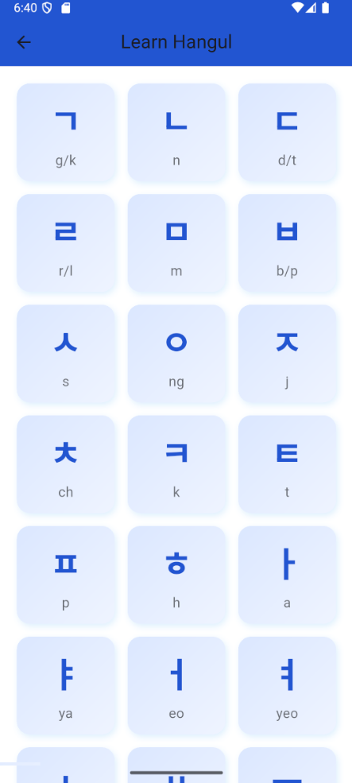
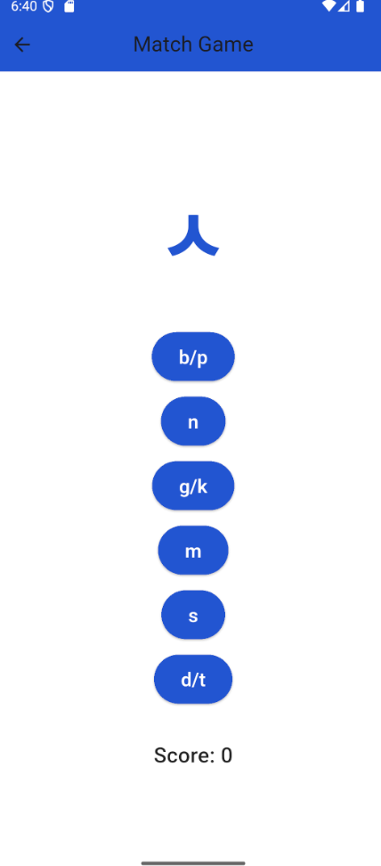
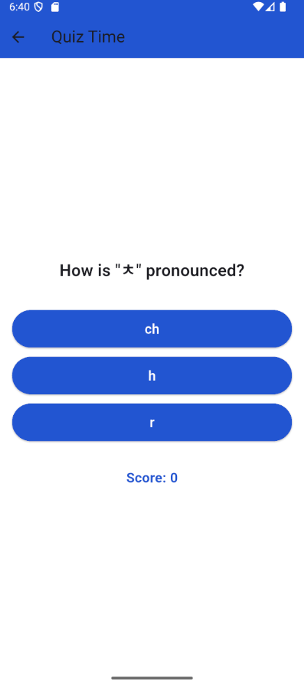
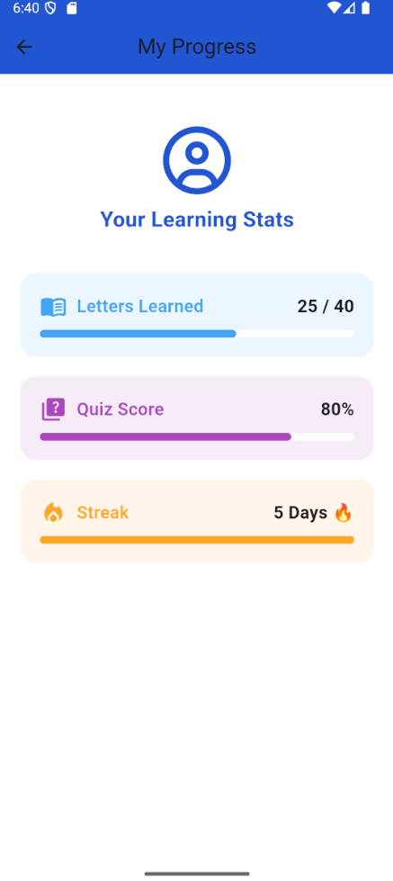
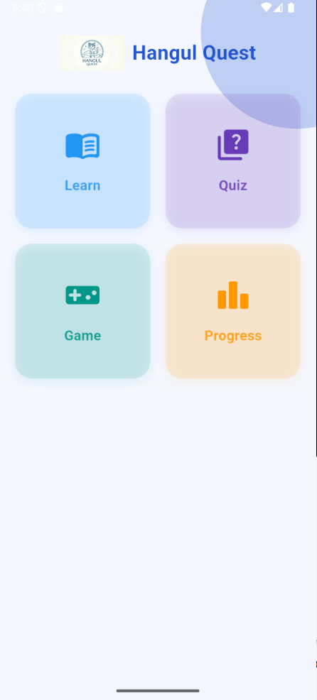
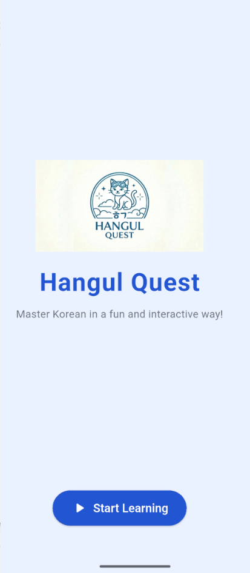

# Hangul Quest - Korean Learning App 

## Project Overview 
**Hangul Quest** is an interactive app for learning the Korean language. It provides users with lessons to master Hangul letters, engaging games, quizzes, and progress tracking to make learning efficient and fun.

--- ## Demo 
Watch the app in action: 
[Demo Video](demo/hangul_app_demo.mp4) 

--- 

## Screenshots Application interfaces: 

- **Learn Hangul Letters** 
- **Matching Game** 
- **Quizzes** 
- **Progress Tracking** 
- **Home Page** 
- **Welcome Page** 

--- 

## Features 
- **Learn Hangul letters**: step-by-step lessons to master the Korean alphabet
- **Matching Game**: interactive game to match letters for better memorization
- **Quizzes**: short quizzes after each lesson to reinforce learning
- **Progress Tracking**: monitor your learning progress
- **User-friendly Interface**: clean and interactive UI for easy navigation

--- 

## Technologies Used 
- **Flutter** (cross-platform mobile development)
- **Dart** (programming language)
- **Git & GitHub** (version control)

--- 

## How to Run 
1. Clone the repository:
```bash git clone https://github.com/hallahalmu/hangul-quest-app.git
